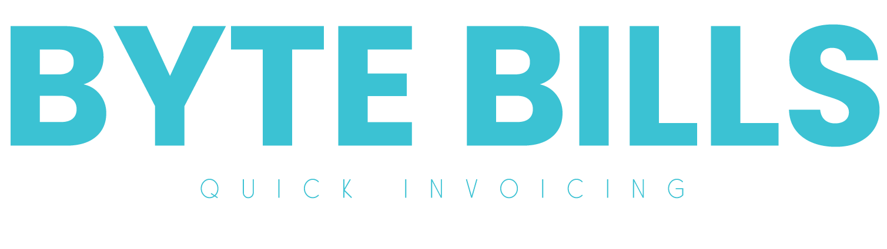
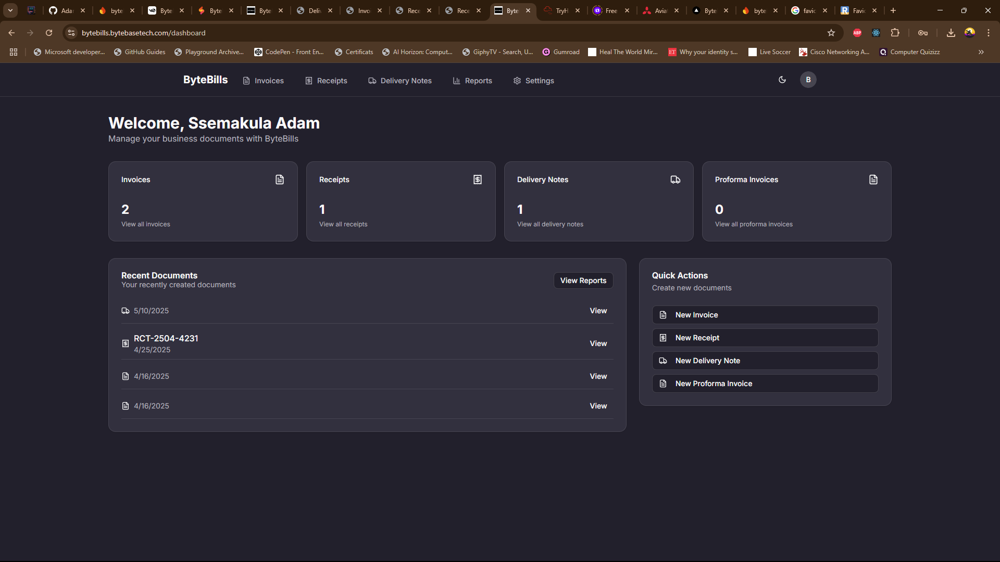
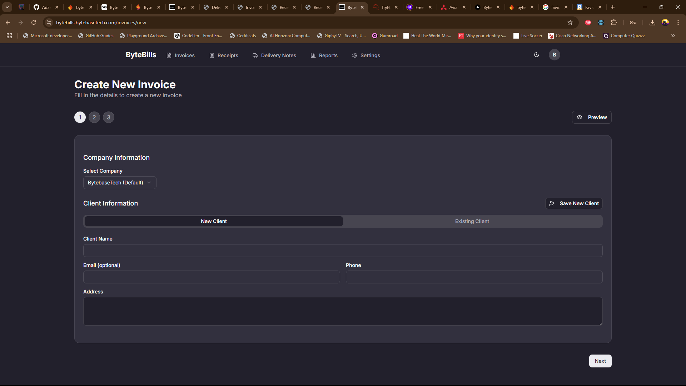
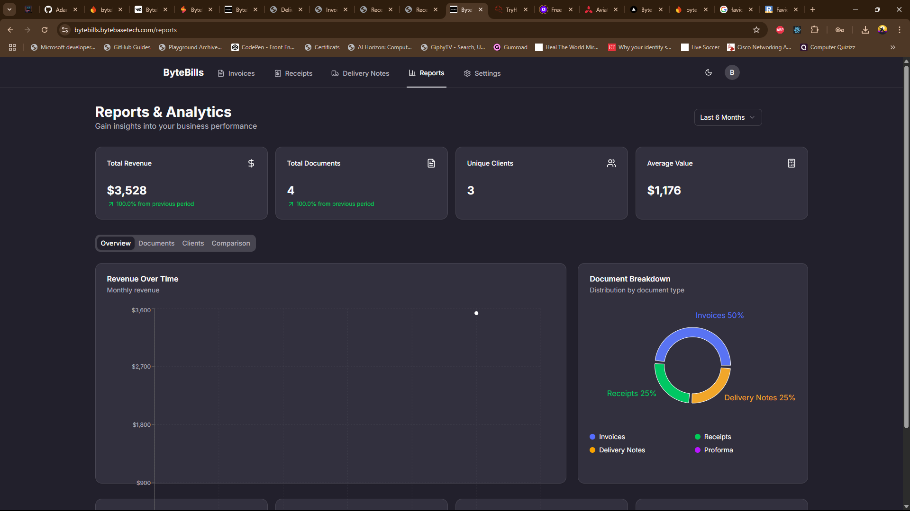
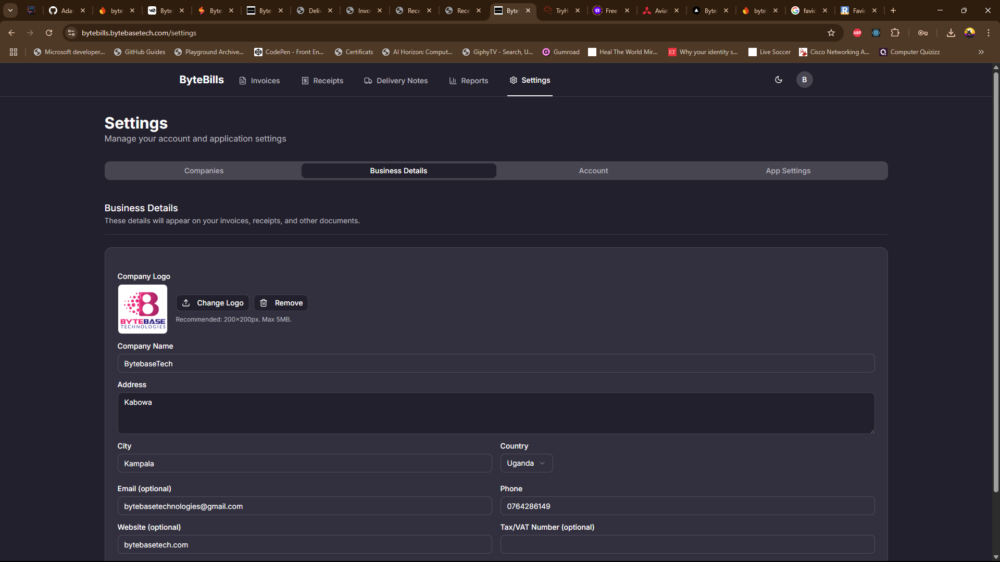

# ByteBills

  

  A modern, full-featured document management system for businesses

## Overview

ByteBills is a comprehensive web application designed to help businesses create, manage, and track various business documents including invoices, receipts, delivery notes, and more. With an intuitive interface and powerful features, ByteBills streamlines document management and provides valuable insights through detailed reports.

## Features

### Document Management
- **Invoices**: Create, edit, and manage professional invoices
- **Receipts**: Generate and track payment receipts
- **Delivery Notes**: Create and manage delivery documentation
- **PDF Generation**: Convert all documents to downloadable PDF format

### Business Tools
- **Client Management**: Store and manage client information
- **Item Catalog**: Save frequently used items for quick addition to documents
- **Email Integration**: Send documents directly to clients via email
- **Document Sharing**: Generate shareable links for documents

### Analytics & Reporting
- **Financial Overview**: Track revenue and payment status
- **Document Analytics**: Monitor document creation patterns
- **Client Insights**: Identify top clients and analyze client behavior
- **Comparative Analysis**: Compare performance across different time periods

### User Experience
- **Responsive Design**: Works seamlessly on desktop and mobile devices
- **Dark Mode**: Toggle between light and dark themes
- **Multi-company Support**: Manage multiple businesses under one account
- **Customizable Settings**: Tailor the application to your business needs

## Screenshots

  
  

  
  

## Technology Stack

- **Frontend**: Next.js, React, TypeScript, Tailwind CSS
- **UI Components**: shadcn/ui
- **Authentication**: Firebase Authentication
- **Database**: Firestore
- **PDF Generation**: jsPDF
- **Deployment**: Vercel

## Getting Started

### Prerequisites

- Node.js 16.x or higher
- npm or yarn
- Firebase account

### Installation

1. Clone the repository:
   \`\`\`bash
   git clone https://github.com/AdamUzDel/ByteBills.git
   cd bytebills
   \`\`\`

2. Install dependencies:
   \`\`\`bash
   npm install
   # or
   yarn install
   \`\`\`

3. Set up environment variables:
   Create a `.env.local` file in the root directory with the following variables:
   \`\`\`
   NEXT_PUBLIC_FIREBASE_API_KEY=your_api_key
   NEXT_PUBLIC_FIREBASE_AUTH_DOMAIN=your_auth_domain
   NEXT_PUBLIC_FIREBASE_PROJECT_ID=your_project_id
   NEXT_PUBLIC_FIREBASE_STORAGE_BUCKET=your_storage_bucket
   NEXT_PUBLIC_FIREBASE_MESSAGING_SENDER_ID=your_messaging_sender_id
   NEXT_PUBLIC_FIREBASE_APP_ID=your_app_id
   \`\`\`

4. Run the development server:
   \`\`\`bash
   npm run dev
   # or
   yarn dev
   \`\`\`

5. Open [http://localhost:3000](http://localhost:3000) in your browser to see the application.

## Deployment

The easiest way to deploy ByteBills is using Vercel:

1. Push your code to a GitHub repository
2. Import the project into Vercel
3. Set the environment variables
4. Deploy

## Contributing

Contributions are welcome! Please feel free to submit a Pull Request.

1. Fork the repository
2. Create your feature branch (`git checkout -b feature/amazing-feature`)
3. Commit your changes (`git commit -m 'Add some amazing feature'`)
4. Push to the branch (`git push origin feature/amazing-feature`)
5. Open a Pull Request

## License

This project is licensed under the MIT License - see the LICENSE file for details.

## Acknowledgements

- [Next.js](https://nextjs.org/)
- [React](https://reactjs.org/)
- [Tailwind CSS](https://tailwindcss.com/)
- [shadcn/ui](https://ui.shadcn.com/)
- [Firebase](https://firebase.google.com/)
- [jsPDF](https://github.com/parallax/jsPDF)
- [Lucide Icons](https://lucide.dev/)

---

  Made with ❤️ by Adam Ssemakula from BytebaseTech

